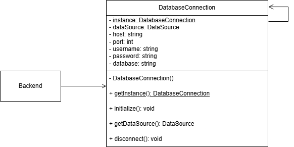

# Padrão de Projeto: Singleton

## Visão Geral

---

## Princípios e Vantagens

A adoção do padrão Singleton traz diversos benefícios alinhados aos princípios de bom design de software:

- **Controle Global de Instâncias:** Garante que apenas uma única instância de uma classe seja criada durante toda a execução da aplicação.
- **Ponto de Acesso Centralizado:** Fornece um ponto global e seguro para acessar a instância única.
- **Economia de Recursos:** Evita a criação desnecessária de múltiplas instâncias de objetos que devem ser únicos (ex: conexão com banco de dados, logger).
- **Segurança de Acesso:** Em ambientes multi-thread, implementa mecanismos de sincronização para garantir que apenas uma instância seja criada.
- **Facilidade de Gerenciamento:** Centraliza o estado e comportamento de recursos compartilhados, tornando o código mais previsível e mantível.

---

## Casos de Uso

É crucial saber quando aplicar (e quando não aplicar) o padrão.

##### ✅ Quando usar Singleton?

- Quando você precisa de uma única instância de uma classe em toda a aplicação (ex: gerenciador de configuração, logger, pool de conexões).
- Quando múltiplas partes do código precisam acessar o mesmo objeto sem conhecer a localização exata dele.
- Quando a criação do objeto é custosa e você deseja reutilizar a mesma instância.
- Para gerenciar recursos compartilhados que devem ter estado único e consistente.

##### 🚫 Quando NÃO usar?

- Em testes unitários, pois o Singleton cria acoplamento global que dificulta mocks e testes isolados.
- Quando você realmente precisa de múltiplas instâncias da mesma classe.

---

## Modelagem no Projeto (Diagrama UML)

O diagrama abaixo ilustra a estrutura do padrão Singleton em nosso projeto.



O diagrama UML define a estrutura do padrão Singleton com os seguintes componentes:

- **Classe Singleton**: Mantém a instância privada e controla seu acesso.
  - `- instance: Singleton` (atributo estático privado)
  - `- Singleton()` (construtor privado)
  - `+ getInstance(): Singleton` (método estático público)
  - `+ operacao()` (métodos de negócio públicos)

---

## Implementação do Padrão Singleton

O padrão Singleton pode ser implementado de diferentes formas. Apresentamos duas abordagens principais:

##### Exemplo de Código: `TypeOrmConnection` (Singleton para Conexão com Banco de Dados)

**Passo 1: A Classe Singleton**

Este é o coração da implementação. A classe `TypeOrmConnection` encapsula a conexão com o banco de dados, garantindo que apenas uma instância exista. O construtor é privado para impedir instanciação direta, e o método `getInstance()` controla o acesso à única instância da classe.

```typescript
import { DataSource } from 'typeorm';
import env from '@/main/config/env';

export interface TypeOrmConnectionOptions {
  host: string;
  port: number;
  username: string;
  password: string;
  database: string;
}

export class TypeOrmConnection {
  private static instance: TypeOrmConnection;
  private dataSource: DataSource | null = null;

  private readonly host: string;
  private readonly port: number;
  private readonly username: string;
  private readonly password: string;
  private readonly database: string;

  private constructor(options: TypeOrmConnectionOptions) {
    this.host = options.host;
    this.port = options.port;
    this.username = options.username;
    this.password = options.password;
    this.database = options.database;
  }

  public static getInstance(): TypeOrmConnection {
    if (!TypeOrmConnection.instance) {
      TypeOrmConnection.instance = new TypeOrmConnection({
        host: env.db_host,
        port: env.db_port,
        username: env.db_user,
        password: env.db_password,
        database: env.db_name,
      });
    }
    return TypeOrmConnection.instance;
  }

  public async initialize(): Promise<void> {
    if (this.dataSource && this.dataSource.isInitialized) {
      return;
    }

    this.dataSource = new DataSource({
      type: 'mysql',
      host: this.host,
      port: this.port,
      username: this.username,
      password: this.password,
      database: this.database,
      synchronize: process.env.NODE_ENV !== 'production',
      logging: process.env.NODE_ENV === 'development',
      entities: [`${__dirname}/models/*.{ts,js}`],
      migrations: [`${__dirname}/migrations/*.{ts,js}`],
    });

    await this.dataSource.initialize();
    console.log('Database connection initialized');
  }

  public getDataSource(): DataSource {
    if (!this.dataSource || !this.dataSource.isInitialized) {
      throw new Error('DataSource is not initialized');
    }
    return this.dataSource;
  }

  public async disconnect(): Promise<void> {
    if (this.dataSource && this.dataSource.isInitialized) {
      await this.dataSource.destroy();
      this.dataSource = null;
    }
  }
}
```

**Passo 2: Uso do Singleton na Inicialização da Aplicação**

Aqui, na inicialização do servidor, chamamos `getInstance()` para obter a única instância. Como é a primeira chamada, a instância é criada automaticamente. Depois, inicializamos o `DataSource` para estabelecer a conexão com o banco MySQL. Todas as requisições posteriores compartilharão essa mesma conexão.

```typescript
TypeOrmConnection.getInstance()
  .initialize()
  .then(async () => {
    const app = await setupApp();
    app.listen(env.port, () => {
      console.log(`Server is running on http://localhost:${env.port}`);
    });
  })
  .catch((error) => {
    console.error('Error during Data Source initialization:', error);
  });
```

**Passo 3: Uso do Singleton em um Repositório**

Este exemplo mostra como qualquer repositório da aplicação acessa o banco de dados. Ao chamar `TypeOrmConnection.getInstance()`, ele sempre recebe a mesma instância criada na inicialização, garantindo uma única conexão. O repositório não precisa gerenciar conexões diretamente - apenas utiliza a instância única fornecida pelo Singleton.

```typescript
import { Repository } from 'typeorm';
import { CompetitionModel } from '../models/competition-model';
import { TypeOrmConnection } from '../typeorm-connection';
import { ICreateCompetitionRepository } from '@/application/protocols/db/create-competition-repository';
import { Competition } from '@/domain/entities/Competition';

export class CompetitionRepository implements ICreateCompetitionRepository {
  private ormRepository: Repository<CompetitionModel>;

  constructor() {
    this.ormRepository = TypeOrmConnection.getInstance().getDataSource().getRepository(CompetitionModel);
  }

  async create(data: Competition): Promise<void> {
    const competition = this.ormRepository.create(data);
    await this.ormRepository.save(competition);
  }
}
```

---

## Para Mais Detalhes

Para informações completas sobre a implementação do padrão Singleton, consultar o arquivo `README.md` na pasta do [monolito](https://github.com/UnBArqDsw2025-2-Turma01/2025.2-T01-G6-QueroBemEstar_Entrega_03/tree/main/monolito) do repositório. Lá você encontrará documentação detalhada sobre a estrutura de pastas, configurações e como executar a aplicação.

---
## Vídeo Apresentação
<iframe width="1425" height="570" src="https://www.youtube.com/embed/HF7S6Epa5Aw" title="Builder" frameborder="0" allow="accelerometer; autoplay; clipboard-write; encrypted-media; gyroscope; picture-in-picture; web-share" referrerpolicy="strict-origin-when-cross-origin" allowfullscreen></iframe>

### Tabela de Participação

| Integrante | Contribuições Principais                                                                                                                                              |
| ---------- | --------------------------------------------------------------------------------------------------------------------------------------------------------------------- |
| **Artur**  | Participou da criação do diagrama, fez a criação do documento, modelou a arquitetura geral do projeto, além da Configuração inicial com TypeScript, Express e TypeORM |
| **Marcos** | Participou da criação do diagrama, da implementação do singleton TypeOrmConnection e criação da entidade Competition do domínio                                       |
| **Mylena** | Participou da criação do diagrama e Implementação do singleton TypeOrmConnection                                                                                      |
| **Yago**   | Participou da criação do diagrama e da implementação do singleton TypeOrmConnection                                                                                   |

## Histórico de Versão

| Versão | Data       | Alteração                             | Responsável       | Revisor | Data de revisão |
| ------ | ---------- | ------------------------------------- | ----------------- | ------- | --------------- |
| 1.0    | 23/10/2025 | Criação do documento sobre Singleton. | Artur Krauspenhar |         |                 |
