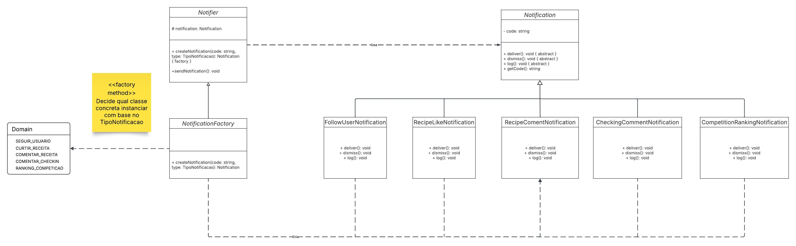

# Padrão de Projeto: Factory Method

## Visão Geral

Este documento descreve a implementação do **padrão de projeto Factory Method** no contexto do sistema de **Notificações**.  
O Factory Method é um padrão **criacional** que fornece uma interface para criação de objetos, mas permite que as subclasses decidam qual classe concreta instanciar. Isso promove **baixo acoplamento** e **alta extensibilidade** ao sistema.

**Intenção:**  
Utilizamos o Factory Method para **centralizar e padronizar** a criação de diferentes tipos de notificações (como seguir usuário, curtir receita, comentar receita, comentar check-in e ranking de competição) sem expor diretamente a lógica de instanciação para o restante do sistema.

---

## Princípios e Vantagens

A aplicação do Factory Method segue princípios fundamentais de design orientado a objetos, resultando em código mais limpo, modular e escalável.

- **Aberto para Extensão, Fechado para Modificação :**  
  Novos tipos de notificações podem ser adicionados sem alterar as classes existentes.

- **Baixo Acoplamento:**  
  O cliente (no caso, o `Notifier`) não precisa conhecer as classes concretas de notificação.

- **Coesão e Organização:**  
  Toda a lógica de criação de notificações é centralizada em um único ponto a classe `NotificationFactory`.

- **Facilidade de Manutenção e Testes:**  
  Modificações em um tipo de notificação não afetam os outros tipos.

- **Padronização:**  
  Todas as notificações seguem a mesma estrutura (métodos `deliver`, `dismiss` e `log`).

---

## Casos de Uso

O padrão Factory Method é especialmente útil quando o sistema precisa lidar com **múltiplos tipos de objetos relacionados** que compartilham uma interface comum, mas têm comportamentos específicos.

#####  Quando usar Factory Method?

- Quando o código precisa criar objetos sem conhecer suas classes concretas.  
- Quando há **múltiplas variações de um mesmo tipo de objeto** (neste caso, notificações).  
- Quando a criação de objetos deve ser **centralizada** e **padronizada**.  
- Quando se deseja **reduzir dependências diretas** entre módulos.

#####  Quando NÃO usar?

- Quando só há **um tipo de objeto**, e a criação direta via `new` é suficiente.  
- Quando o tipo de objeto criado **não deve variar em subclasses**.  
- Quando o número de classes concretas é fixo e não cresce com o tempo.

---

## Modelagem no Projeto (Diagrama UML)

O diagrama abaixo representa a estrutura do padrão Factory Method aplicada ao módulo de notificações.



### Estrutura e Papéis

- **Produto Abstrato:**  
  `Notification` : define a interface comum para todos os tipos de notificação (`deliver()`, `dismiss()`, `log()`).

- **Produtos Concretos:**  
  - `FollowUserNotification`
  - `RecipeLikeNotification`
  - `RecipeCommentNotification`
  - `CheckinCommentNotification`
  - `CompetitionRankingNotification`

  Cada uma implementa o comportamento específico dos métodos definidos na classe abstrata `Notification`.

- **Criador Abstrato:**  
  `Notifier`  declara o método abstrato `createNotification()` e implementa `sendNotification()`, que usa o produto sem conhecer sua classe concreta.

- **Criador Concreto:**  
  `NotificationFactory`  sobrescreve o método `createNotification()` e decide qual classe concreta instanciar com base no `TipoNotificacao`.

- **Enum de Domínio:**  
  `TipoNotificacao` define os tipos de notificação possíveis (`SEGUIR_USUARIO`, `CURTIR_RECEITA`, `COMENTAR_RECEITA`, `COMENTAR_CHECKIN`, `RANKING_COMPETICAO`).

---

## Estrutura do Código Aplicada

### 1. Produto Abstrato

```ts
export abstract class Notification {
  constructor(private readonly code: string) {}

  abstract deliver(): void;
  abstract dismiss(): void;
  abstract log(): void;

  getCode(): string {
    return this.code;
  }
}
```

---

### 2. Produtos Concretos

Exemplo: `FollowUserNotification.ts`
```ts
import { Notification } from "../product/Notification";

export class FollowUserNotification extends Notification {
  deliver(): void { console.log("Deliver: follow user"); }
  dismiss(): void { console.log("Dismiss: follow user"); }
  log(): void     { console.log("Log: follow user"); }
}
```

Os demais (`RecipeLikeNotification`, `RecipeCommentNotification`, `CheckinCommentNotification`, `CompetitionRankingNotification`) seguem o mesmo padrão, variando apenas no conteúdo da mensagem.

---

### 3. Criador Abstrato

```ts
import { Notification } from "../product/Notification";

export abstract class Notifier {
  protected notification!: Notification;

  abstract createNotification(code: string, type: unknown): Notification;

  sendNotification(): void {
    console.log(`Sending: ${this.notification.getCode()}`);
    this.notification.deliver();
    this.notification.log();
  }
}
```

---

### 4. Criador Concreto (Factory)

```ts
import { Notifier } from "../creator/Notifier";
import { TipoNotificacao } from "../domain/TipoNotificacao";
import { Notification } from "../product/Notification";
import { FollowUserNotification } from "../concreteProduct/FollowUserNotification";
import { RecipeLikeNotification } from "../concreteProduct/RecipeLikeNotification";
import { RecipeCommentNotification } from "../concreteProduct/RecipeCommentNotification";
import { CheckinCommentNotification } from "../concreteProduct/CheckinCommentNotification";
import { CompetitionRankingNotification } from "../concreteProduct/CompetitionRankingNotification";

export class NotificationFactory extends Notifier {
  createNotification(code: string, type: TipoNotificacao): Notification {
    switch (type) {
      case TipoNotificacao.SEGUIR_USUARIO:
        this.notification = new FollowUserNotification(code);
        break;
      case TipoNotificacao.CURTIR_RECEITA:
        this.notification = new RecipeLikeNotification(code);
        break;
      case TipoNotificacao.COMENTAR_RECEITA:
        this.notification = new RecipeCommentNotification(code);
        break;
      case TipoNotificacao.COMENTAR_CHECKIN:
        this.notification = new CheckinCommentNotification(code);
        break;
      case TipoNotificacao.RANKING_COMPETICAO:
        this.notification = new CompetitionRankingNotification(code);
        break;
      default:
        throw new Error(`Tipo de notificação não suportado: ${type}`);
    }
    return this.notification;
  }
}
```

---

## Demonstração de Uso

```ts
import { NotificationFactory } from "./concreteCreator/NotificationFactory";
import { TipoNotificacao } from "./domain/TipoNotificacao";

const factory = new NotificationFactory();

factory.createNotification("NTF-001", TipoNotificacao.SEGUIR_USUARIO);
factory.sendNotification();

factory.createNotification("NTF-002", TipoNotificacao.CURTIR_RECEITA);
factory.sendNotification();
```

**Saída esperada:**
```
Sending: NTF-001
Deliver: follow user
Log: follow user
---
Sending: NTF-002
Deliver: recipe like
Log: recipe like
---
```

---

## Benefícios no Projeto

| Vantagem | Aplicação Prática |
|-----------|-------------------|
| Extensibilidade | Novos tipos de notificação podem ser adicionados facilmente (basta criar uma nova subclasse e ajustar a factory). |
| Organização | A lógica de criação de objetos fica isolada da lógica de negócio. |
| Reutilização | O método `sendNotification()` funciona para qualquer tipo de notificação. |
| Testabilidade | Cada tipo de notificação pode ser testado isoladamente. |
| Clareza | O código cliente não precisa saber qual classe concreta instanciar. |

---

## Referências Bibliográficas

> GAMMA, Erich; HELM, Richard; JOHNSON, Ralph; VLISSIDES, John. *Design Patterns: Elements of Reusable Object-Oriented Software.* Addison-Wesley, 1994.  
>  
> REFACTORING GURU. *Design Patterns: Factory Method.* Disponível em: <https://refactoring.guru/design-patterns/factory-method>. Acesso em: 23 out. 2025.  
>  
> SERRANO, Milene. *Aula - GOFs Criacionais.* Universidade de Brasília, 2025.  

---

## Tabela de Participação

| Integrante | Contribuições Principais |
|-------------|---------------------------|
| Filipe Bressanelli | Implementação da estrutura do padrão Factory Method no módulo de Notificações, elaboração do diagrama UML e documentação técnica. |
| Eduardo Ferreira | Revisão da estrutura do padrão Factory Method no módulo de Notificações, elaboração do diagrama UML e documentação técnica. |
| Gabriel Soares | Revisão da estrutura do padrão Factory Method no módulo de Notificações, elaboração do diagrama UML e documentação técnica. |
---

## Histórico de Versão

| Versão | Data | Alteração | Responsável | Revisor | Data de revisão |
|---------|------|------------|--------------|----------|-----------------|
| 1.0 | 23/10/2025 | Criação do documento do padrão Factory Method e diagrama UML | Filipe Bressanelli | — | — |
