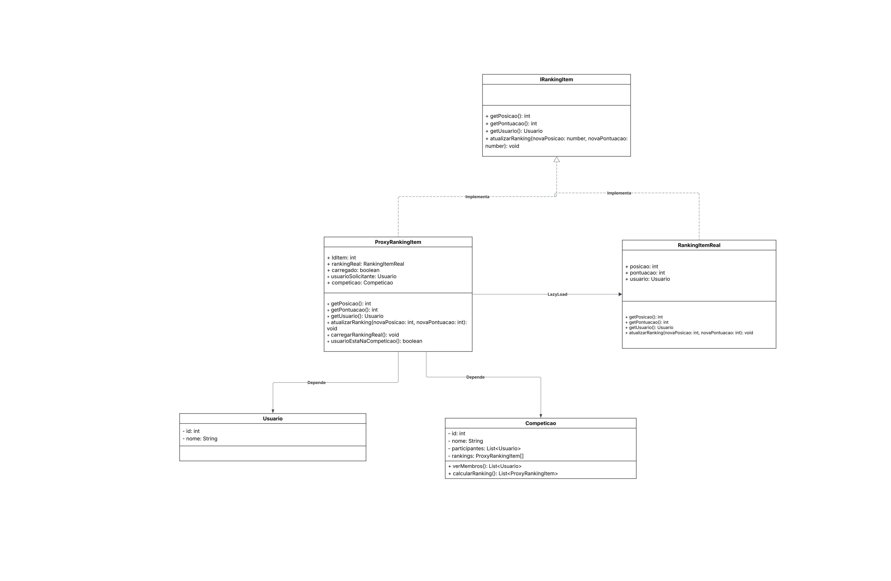

# 3.2.1. Proxy 

## Introdução 

Proxy é um padrão de projeto que serve para controlar o acesso ao objeto real, permitindo que você execute algo antes ou depois que a solicitação chegue ao objeto original. O proxy é ideal para quando você tem um objeto enorme que consome uma enorme quantidade de recursos de sistema. Você precisa dele de vez em quando, mas nem sempre. Sendo assim, o proxy pode aplicar uma série de estratégias para evitar o desperdício e chamadas desnecessárias, como, por exemplo, autenticação, cache e lazy loading.

## O proxy no contexto do Quero Bem Estar

No contexto do sistema Quero Bem Estar, o padrão Proxy é aplicado para gerenciar o sistema de ranqueamento dos usuários participantes de uma competição, conforme representado no [diagrama de classes do projeto](https://unbarqdsw2025-2-turma01.github.io/2025.2-T01-G6-QueroBemEstar_Entrega_02/#/./Modelagem/ModelagemEstatica/2.1.1.DiagramaClasses). O ranking tem como objetivo atribuir pontuações aos usuários com base em suas atividades diárias. Cada participante registra seus check-ins de refeições, que são posteriormente validados pelos demais membros do grupo. Quando a maioria aprova o check-in, o usuário responsável recebe pontos. Ao final do período da competição, o vencedor é determinado pelo maior número de pontos acumulados, refletindo seu engajamento e constância nas atividades propostas pelo sistema. Ao longo da competição, os usuários podem consultar o ranking para acompanhar seu desempenho em tempo real. No entanto, o acesso frequente a essas informações pode gerar um alto custo operacional, especialmente quando envolve o carregamento constante de dados atualizados de múltiplos participantes.


## Metodologia

O sistema é composto por um conjunto de classes que representam usuários, competições e itens de ranking, interligadas de forma a garantir a integridade das informações e a eficiência na exibição dos resultados.

As principais classes implementadas são:

- Usuario: representa os participantes cadastrados no sistema. Cada usuário possui um identificador único e pode participar de diferentes competições.

- Competicao: é responsável por gerenciar o conjunto de usuários participantes e seus respectivos itens de ranking, além de controlar a atualização das pontuações.

- IRankingItem: define a interface comum para os objetos que representam posições no ranking. Ela estabelece os métodos necessários para acessar e atualizar as informações, garantindo polimorfismo entre o objeto real (RankingItemReal) e o proxy (ProxyRankingItem).

- RankingItemReal: contém a implementação concreta dos dados de ranking de um usuário, armazenando sua posição, pontuação e informações associadas.

- ProxyRankingItem: constitui o núcleo da aplicação do padrão Proxy. Assim como RankingItemReal, ela implementa a interface IRankingItem, mas atua como um intermediário entre o sistema e o objeto real, controlando o acesso às informações.

O Proxy desempenha um papel essencial ao restringir o acesso a usuários não participantes da competição e ao instanciar o objeto real apenas quando necessário, aplicando o conceito de carregamento sob demanda (lazy loading). Essa abordagem otimiza o desempenho do sistema e garante que apenas usuários autorizados possam visualizar os dados do ranking.


## Diagrama





<font size="3">
<p style="text-align: center">
<b>Autor(es):</b>  
<a href="https://github.com/JoaoPedro2206" target="_blank">João Pedro Ferreira Moraes</a>, 
<a href="https://github.com/JoseViniciusQueiroz" target="_blank">Jose Vinicius Alvares Soares de Queiroz</a>,
<a href="https://github.com/leohssjr" target="_blank">Leonardo Henrique Sobral Sauma Junior</a>. 2025
<br>Link Artefato: <a href="https://lucid.app/lucidchart/e9218b82-d183-4ea3-8e7e-cf2901682610/edit?viewport_loc=-2880%2C-676%2C4380%2C1960%2C0_0&invitationId=inv_cbe648ac-d8a1-47b2-925d-74aa9faca27b" target="_blank">LucidChart</a>
</p>
</font> 


## Implementação 

### Usuario.ts
```
export class Usuario {
  constructor(public id: number, public nome: string) {}
}

```

### Competicao.ts
```
import { Usuario } from "./Usuario";
import { ProxyRankingItem } from "./ProxyRankingItem";


export class Competicao {
  participantes: Usuario[];
  rankings: ProxyRankingItem[];

  constructor(public id: number, public nome: string, participantes?: Usuario[]) {
    this.participantes = participantes || [];

    this.rankings = this.participantes.map((usuario, index) =>
        new ProxyRankingItem(index + 1, usuario, this) 
    );
  }

  verMembros(usuario: Usuario): boolean {
    return this.participantes.some(u => u.id === usuario.id);
  }
  calcularRanking(): ProxyRankingItem[] {

    this.rankings.sort((a, b) => b.getPontuacao() - a.getPontuacao());

    this.rankings.forEach((proxy, idx) => {
        proxy.atualizarRanking(idx + 1, proxy.getPontuacao());
    });

    return this.rankings;
  }
}
```

### IrankingItem.ts 
```
import { Usuario } from "./Usuario";


export interface IRankingItem {
  getPosicao(): number;
  getPontuacao(): number;
  getUsuario(): Usuario;
  atualizarRanking(novaPosicao: number, novaPontuacao: number): void;
}

```

### RankingItemReal.ts
```
import { Usuario } from "./Usuario";
import type { IRankingItem } from "./IrankingItem";

export class RankingItemReal implements IRankingItem {
  constructor(
    public posicao: number,
    public pontuacao: number,
    public usuario: Usuario
  ) {}

  getPosicao(): number {
    return this.posicao;
  }
  getPontuacao(): number {
    return this.pontuacao;
  }
  getUsuario(): Usuario {
    return this.usuario;
  }
  atualizarRanking(novaPosicao: number, novaPontuacao: number): void {
    this.posicao = novaPosicao;
    this.pontuacao = novaPontuacao;
  }
}

```

### ProxyRankingItem.ts
```
import { RankingItemReal } from "./RankingItemReal";
import { Usuario } from "./Usuario";
import type { IRankingItem } from "./IrankingItem";
import { Competicao } from "./Competicao";

export class ProxyRankingItem implements IRankingItem {
  private rankingReal: RankingItemReal | null = null;
  private carregado: boolean = false;

  constructor(
    public idItem: number,
    public usuarioSolicitante: Usuario,
    public competicao: Competicao
  ) {}

  private carregarRankingReal(): void {
    if (!this.carregado) {
      const pontuacaoAleatoria = Math.floor(Math.random() * 1000);
      this.rankingReal = new RankingItemReal(1, pontuacaoAleatoria, this.usuarioSolicitante);
      this.carregado = true;
    }
  }

  private usuarioEstaNaCompeticao(): boolean {
    return this.competicao.verMembros(this.usuarioSolicitante);
  }

  getPosicao(): number {
    if (!this.usuarioEstaNaCompeticao())
      throw new Error("Acesso negado: usuário não está na competição.");
    this.carregarRankingReal();
    return this.rankingReal!.getPosicao();
  }

  getPontuacao(): number {
    if (!this.usuarioEstaNaCompeticao())
      throw new Error("Acesso negado: usuário não está na competição.");
    this.carregarRankingReal();
    return this.rankingReal!.getPontuacao();
  }

  getUsuario(): Usuario {
    if (!this.usuarioEstaNaCompeticao())
      throw new Error("Acesso negado: usuário não está na competição.");
    this.carregarRankingReal();
    return this.rankingReal!.getUsuario();
  }


  atualizarRanking(novaPosicao: number, novaPontuacao: number): void {
  this.carregarRankingReal();
  if (this.rankingReal) {
    this.rankingReal.atualizarRanking(novaPosicao, novaPontuacao);
  }
}
}

```
## Vídeo Apresentação
<iframe width="1425" height="570" src="https://www.youtube.com/embed/VkMaE_nE8kk" title="Proxy" frameborder="0" allow="accelerometer; autoplay; clipboard-write; encrypted-media; gyroscope; picture-in-picture; web-share" referrerpolicy="strict-origin-when-cross-origin" allowfullscreen></iframe>

### Tabela de Participação
| Integrante | Contribuições Principais |
|-------------|------------------------------------------------------------------------------------------|
| [José Vinicius](https://github.com/JoseViniciusQueiroz) | Responsável principal pelo desenvolvimento do padrão **Proxy**, incluindo estruturação do código, explicação conceitual e formatação do conteúdo em Markdown. |
| [João Pedro Moraes](https://github.com/JoaoPedro2206) | Contribuiu na documentação e revisão do texto explicativo sobre o padrão Proxy e na elaboração do UML. |
| [Leonardo Sauma](https://github.com/leohssjr) | Contribuiu com revisões e sugestões de aprimoramento do código e exemplos, além de contribuir na elaboração do UML. |


## Referências Bibliograficas
> REFACTORING GURU. Design Patterns. Disponível em: <https://refactoring.guru/design-patterns>. Acesso em: 23 out. 2025.

> GLEEK. Class Diagram Arrows Explained. Disponível em: <https://www.gleek.io/blog/class-diagram-arrows#google_vignette>. Acesso em: 23 out. 2025.

> SERRANO, Milene. AULA - GOFs Estruturais. [Apresentação de slides utilizada na disciplina de Arquitetura e Desenho de Software] – [Universidade de Basilia], 2025.


## Histórico de Versão

| Versão | Data | Alteração | Responsável | Revisor | Data de revisão |
| ------ | ---- | --------- | ----------- | ------- | --------------- |
| 1.0    | 22/10/2025 | Criação do documento e conteúdo. |  [José Vinicius](https://github.com/JoseViniciusQueiroz)|[Leonardo Sauma](https://github.com/leohssjr) | 24/10/2025|