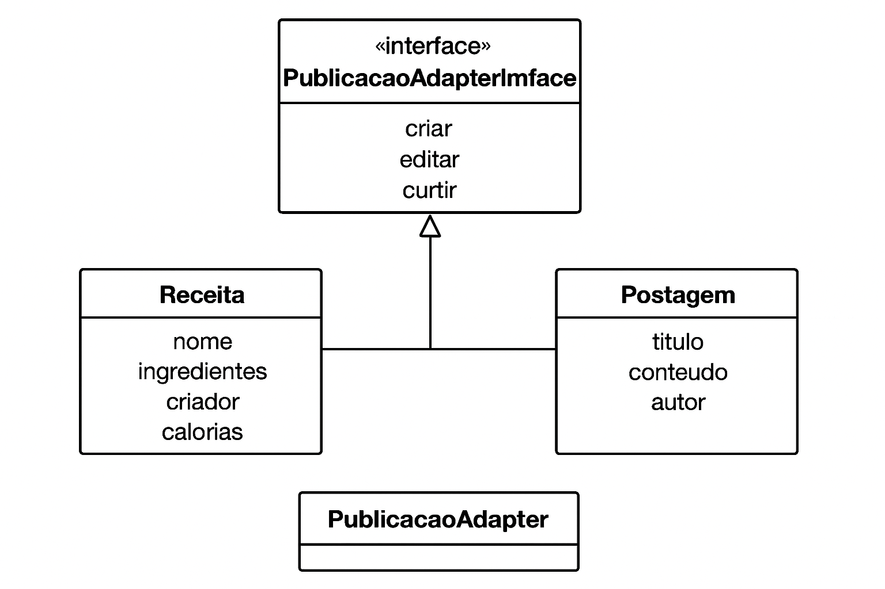
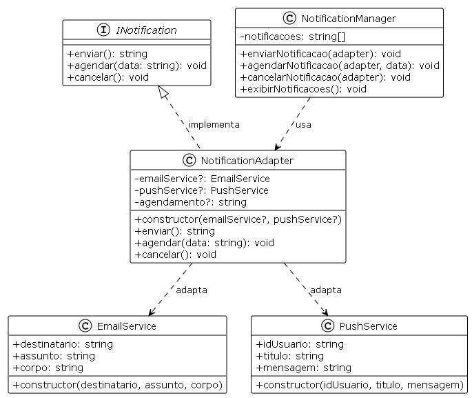
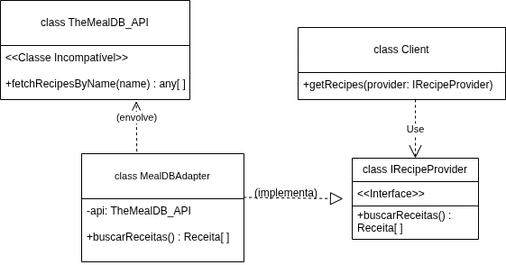

# Padrão Adapter — Projeto Quero Bem Estar

## Introdução

O padrão de projeto **Adapter** é utilizado para permitir que classes com interfaces incompatíveis possam trabalhar juntas, atuando como um tradutor entre elas. Ele adapta a interface de uma classe existente para outra interface esperada pelo sistema, sem a necessidade de modificar o código original. Isso garante flexibilidade, reuso de código e um design mais desacoplado.

No contexto do sistema **Quero Bem Estar**, o Adapter foi aplicado em três frentes principais:

1. **Publicações**: Unifica diferentes tipos de publicações feitas pelos usuários — como receitas, postagens e eventos — em uma interface única.
2. **Notificações**: Integra diferentes serviços de notificação (E-mail e Push) através de uma interface padronizada.
3. **Consumo de APIs Externas**: Permite integração com APIs externas como TheMealDB, traduzindo dados incompatíveis para o formato esperado pelo sistema.

Essas abordagens são especialmente úteis no **Quero Bem Estar**, que é uma plataforma colaborativa voltada à promoção de hábitos alimentares saudáveis. Nela, as pessoas compartilham suas experiências culinárias, dicas de alimentação e eventos relacionados à saúde e bem-estar, recebem notificações sobre atividades relevantes na plataforma e acessam receitas através de APIs externas, tudo de forma integrada e padronizada.

---

## Metodologia

O desenvolvimento dos Adapters iniciou com a análise das necessidades do sistema:

### Adapter de Publicações

Foi analisado as entidades relacionadas às interações do usuário dentro da plataforma — **Receita**, **Postagem** e **Evento**. Cada uma possui atributos e comportamentos distintos, mas todas representam uma forma de compartilhamento de informação.

A partir disso, foi criada uma **interface abstrata** definindo os métodos essenciais (como `criar`, `editar` e `curtir`) que todas as entidades devem seguir. Em seguida, foi implementado o **Adapter unificado**, responsável por orquestrar o comportamento específico de cada tipo de publicação.

### Adapter de Notificações

Foi identificada a necessidade de integrar diferentes serviços de notificação (**E-mail** e **Push**) que possuem estruturas de dados distintas. O serviço de e-mail trabalha com destinatário, assunto e corpo da mensagem, enquanto o serviço push utiliza ID de usuário, título e mensagem.

Foi então criada uma **interface INotification** com métodos padronizados (`enviar`, `agendar` e `cancelar`), e implementado o **NotificationAdapter** que converte os diferentes formatos de dados para essa interface unificada.

### Adapter para Consumo de APIs Externas

Foi identificada a necessidade de integrar APIs externas (como **TheMealDB_API**) que retornam dados em formato incompatível com a estrutura esperada pelo sistema. A API externa usa nomes de propriedades diferentes (ex: `strMeal`, `strInstructions`) e estruturas que não correspondem aos objetos **Receita** do sistema.

Para resolver essa incompatibilidade, foi criada uma **interface IRecipeProvider** que define o contrato esperado pelo sistema e implementado o **MealDBAdapter** que atua como tradutor, convertendo os dados da API externa para o formato esperado pelo sistema.

---

## Modelagem

A modelagem baseia-se em uma estrutura orientada a objetos, onde as classes concretas são manipuladas de maneira uniforme pelos Adapters. Esse design favorece a extensibilidade e a clareza arquitetural.

### Adapter de Publicações

As classes concretas **Receita**, **Postagem** e **Evento** herdam características comuns e são manipuladas pelo **PublicacaoAdapter**. Esse design permite aplicar operações genéricas — como criação, edição e curtidas — sem que o sistema precise conhecer a implementação detalhada de cada tipo de publicação.



### Adapter de Notificações

As classes **EmailService** e **PushService** representam diferentes formas de envio de notificações. O **NotificationAdapter** atua como intermediário, convertendo as estruturas específicas de cada serviço para a interface unificada **INotification**.



### Adapter para Consumo de APIs Externas

A classe **TheMealDB_API** (API externa) possui estrutura incompatível com a interface **IRecipeProvider** esperada pelo sistema. O **MealDBAdapter** atua como tradutor, implementando a interface esperada e envelopando a API externa para traduzir respostas para objetos **Receita**.



---

## Código

### 1. Adapter de Publicações

#### 1.1. Entidades de Publicação (`adapter.ts`)

````TypeScript
// Receita.ts
export class Receita {
  constructor(
    public nome: string,
    public ingredientes: string[],
    public criador: string,
    public calorias: number
  ) {}
}

// Postagem.ts
export class Postagem {
  constructor(
    public titulo: string,
    public conteudo: string,
    public autor: string
  ) {}
}

---

### Interface do Adapter (`adapter.ts`)

```TypeScript
// IPublicacaoAdapter.ts
export interface IPublicacaoAdapter {
  criar(): string;
  editar(novo_conteudo: string): void;
  curtir(): void;
}
````

---

#### 1.3. Implementação do Adapter Unificado (`adapter.ts`)

```TypeScript
// PublicacaoAdapter.ts
import { IPublicacaoAdapter } from './IPublicacaoAdapter';
import { Receita } from './Receita';
import { Postagem } from './Postagem';
import { Evento } from './Evento';

export class PublicacaoAdapter implements IPublicacaoAdapter {
  private curtidas: number = 0;

  // Injetamos as dependências (opcionais) pelo construtor
  constructor(
    private readonly receita?: Receita,
    private readonly postagem?: Postagem,
    private readonly evento?: Evento
  ) {}

  public criar(): string {
    if (this.receita) {
      return `Receita criada: ${this.receita.nome} por ${this.receita.criador}`;
    } else if (this.postagem) {
      return `Postagem criada: ${this.postagem.titulo} por ${this.postagem.autor}`;
    } 
    // A lógica original do seu 'criar()' em Python não tratava 'evento',
    // então mantemos essa lógica:
    else {
      throw new Error('Nenhuma publicação fornecida.');
    }
  }

  public editar(novo_conteudo: string): void {
    console.log(`Publicação editada: ${novo_conteudo}`);
  }

  public curtir(): void {
    this.curtidas++;
    console.log(`Publicação curtida! Total: ${this.curtidas}`);
  }
}
```

---

#### 1.4. Gerenciador e Teste (`teste_adapter.ts`)

```TypeScript
// PublicacaoManager.ts
import { IPublicacaoAdapter } from './IPublicacaoAdapter';
import { PublicacaoAdapter } from './PublicacaoAdapter';
import { Receita } from './Receita';
import { Postagem } from './Postagem';
// Evento é importado no original, mas não usado no teste
// import { Evento } from './Evento';

export class PublicacaoManager {
  // O array armazena as strings retornadas pelo método 'criar()'
  private readonly publicacoes: string[] = [];

  public criarPublicacao(adapter: IPublicacaoAdapter): void {
    const p = adapter.criar();
    this.publicacoes.push(p);
    console.log(p);
  }

  public editarPublicacao(adapter: IPublicacaoAdapter, conteudo: string): void {
    adapter.editar(conteudo);
  }

  public curtirPublicacao(adapter: IPublicacaoAdapter): void {
    adapter.curtir();
  }

  public exibirPublicacoes(): void {
    console.log('\n--- Publicações ---');
    this.publicacoes.forEach((p, idx) => {
      console.log(`${idx + 1}. ${p}`);
    });
  }
}

// --- Teste do Adapter (equivalente ao 'if __name__ == "__main__":') ---
// (Para executar, use: ts-node PublicacaoManager.ts)
if (require.main === module) {
  const manager = new PublicacaoManager();

  const receita = new Receita(
    'Smoothie Verde',
    ['Espinafre', 'Banana', 'Maçã'],
    'Ana',
    150
  );
  
  const postagem = new Postagem(
    'Benefícios da aveia',
    'A aveia ajuda na digestão...',
    'Carlos'
  );

  // O construtor é (receita?, postagem?, evento?)
  const adapterReceita = new PublicacaoAdapter(receita);
  const adapterPostagem = new PublicacaoAdapter(undefined, postagem);

  manager.criarPublicacao(adapterReceita);
  manager.criarPublicacao(adapterPostagem);

  manager.curtirPublicacao(adapterReceita);
  manager.editarPublicacao(adapterPostagem, 'Novo conteúdo sobre aveia!');
  
  manager.exibirPublicacoes();
}
```

---

### 2. Adapter de Notificações

#### 2.1. Serviços de Notificação (`EmailService.ts` e `PushService.ts`)

```typescript
// EmailService.ts
export class EmailService {
  public destinatario: string;
  public assunto: string;
  public corpo: string;

  constructor(destinatario: string, assunto: string, corpo: string) {
    this.destinatario = destinatario;
    this.assunto = assunto;
    this.corpo = corpo;
  }
}

// PushService.ts
export class PushService {
  public idUsuario: string;
  public titulo: string;
  public mensagem: string;

  constructor(idUsuario: string, titulo: string, mensagem: string) {
    this.idUsuario = idUsuario;
    this.titulo = titulo;
    this.mensagem = mensagem;
  }
}
```

---

#### 2.2. Interface do Adapter de Notificações (`INotification.ts`)

```typescript
export interface INotification {
  enviar(): string;
  agendar(data: string): void;
  cancelar(): void;
}
```

---

#### 2.3. Implementação do Adapter de Notificações (`NotificationAdapter.ts`)

```typescript
import { INotification } from './INotification';
import { EmailService } from './EmailService';
import { PushService } from './PushService';

export class NotificationAdapter implements INotification {
  private readonly emailService?: EmailService;
  private readonly pushService?: PushService;
  private agendamento?: string;

  constructor(emailService?: EmailService, pushService?: PushService) {
    this.emailService = emailService;
    this.pushService = pushService;
  }

  enviar(): string {
    if (this.emailService) {
      return `E-mail enviado: ${this.emailService.assunto} para ${this.emailService.destinatario}`;
    } else if (this.pushService) {
      return `Notificação Push enviada: ${this.pushService.titulo} para usuário ${this.pushService.idUsuario}`;
    } else {
      throw new Error('Nenhum serviço de notificação fornecido.');
    }
  }

  agendar(data: string): void {
    this.agendamento = data;
    console.log(`Notificação agendada para: ${data}`);
  }

  cancelar(): void {
    console.log('Notificação cancelada.');
  }
}
```

---

#### 2.4. Gerenciador e Teste (`NotificationSystem.ts`)

```typescript
import { NotificationAdapter } from './NotificationAdapter';
import { EmailService } from './EmailService';
import { PushService } from './PushService';

export class NotificationManager {
  private readonly notificacoes: string[] = [];

  enviarNotificacao(adapter: NotificationAdapter): void {
    const resultado = adapter.enviar();
    this.notificacoes.push(resultado);
    console.log(resultado);
  }

  agendarNotificacao(adapter: NotificationAdapter, data: string): void {
    adapter.agendar(data);
  }

  cancelarNotificacao(adapter: NotificationAdapter): void {
    adapter.cancelar();
  }

  exibirNotificacoes(): void {
    console.log('\n--- Notificações Enviadas ---');
    for (let i = 0; i < this.notificacoes.length; i++) {
      console.log(`${i + 1}. ${this.notificacoes[i]}`);
    }
  }
}

// Teste do Adapter
if (require.main === module) {
  const manager = new NotificationManager();

  const emailService = new EmailService(
    'usuario@gmail.com',
    'Bem-vindo ao Quero Bem Estar!',
    'Obrigado por se cadastrar em nossa plataforma.'
  );

  const pushService = new PushService(
    'user_12345',
    'Nova Competição Disponível',
    'Participe da competição de receitas fitness!'
  );

  const adapterEmail = new NotificationAdapter(emailService);
  const adapterPush = new NotificationAdapter(undefined, pushService);

  manager.enviarNotificacao(adapterEmail);
  manager.enviarNotificacao(adapterPush);

  manager.agendarNotificacao(adapterEmail, '2025-11-20 10:00');
  manager.cancelarNotificacao(adapterPush);

  manager.exibirNotificacoes();
}
```

---

### 3. Adapter para Consumo de APIs Externas

#### 3.1. O Que Foi Feito

O padrão **Adapter** foi implementado para permitir que duas interfaces incompatíveis trabalhem juntas.

No projeto, o sistema precisa de objetos `Receita` e espera uma interface (`IRecipeProvider`) para buscá-los. No entanto, queríamos usar uma API externa (ex: `TheMealDB_API`) que retorna dados em um formato totalmente diferente (ex: `strMeal`, `strInstructions`) e com métodos de nomes diferentes (ex: `fetchRecipesByName`).

Para resolver essa incompatibilidade, criamos uma classe "tradutora", o `MealDBAdapter`.

- **O Alvo (Interface):** A `IRecipeProvider` é o "contrato" que o nosso sistema entende e espera.
- **A Classe Incompatível:** A `TheMealDB_API` é a classe externa que queremos usar, mas que "fala outra língua".
- **O Adaptador:** A classe `MealDBAdapter` é o tradutor. Ela **implementa** a interface `IRecipeProvider` (para o sistema poder usá-la) e, ao mesmo tempo, **envolve** (contém) uma instância da `TheMealDB_API` para fazer o trabalho real e traduzir a resposta.

Isso permite que o nosso sistema (`Client`) trate o `MealDBAdapter` como se fosse qualquer outro `IRecipeProvider`, sem nunca saber da complexidade da API externa que está por trás.

---

#### 3.2. Implementação

##### 3.2.1. O Sistema (Alvo) (`adapter.ts`)

### Adapter de Publicações

A implementação foi testada para garantir que diferentes tipos de publicações (receitas, postagens e eventos) possam ser tratados de maneira uniforme. O Adapter permite criar, editar e curtir qualquer tipo de publicação sem que o sistema precise conhecer sua estrutura interna.

Esse comportamento foi validado por meio de execuções simples, nas quais o mesmo gerenciador foi capaz de lidar com instâncias de diferentes tipos de objetos de forma transparente.

### Adapter de Notificações

O sistema de notificações foi testado para garantir que serviços diferentes (E-mail e Push) possam ser tratados através da mesma interface. O NotificationManager consegue enviar, agendar e cancelar notificações independentemente do tipo de serviço subjacente.

**Saída de Exemplo:**

```
E-mail enviado: Bem-vindo ao Quero Bem Estar! para usuario@gmail.com
Notificação Push enviada: Nova Competição Disponível para usuário user_12345
Notificação agendada para: 2025-11-20 10:00
Notificação cancelada.

--- Notificações Enviadas ---
1. E-mail enviado: Bem-vindo ao Quero Bem Estar! para usuario@gmail.com
2. Notificação Push enviada: Nova Competição Disponível para usuário user_12345
```

Assim, o padrão Adapter promoveu um design mais limpo, flexível e escalável em todas as implementações.

---

## Conclusão

A aplicação do **padrão Adapter** no **Quero Bem Estar** proporcionou uma forma eficiente de integrar diferentes tipos de entidades através de interfaces unificadas:

- **Publicações**: Receitas, postagens e eventos podem ser gerenciados de forma uniforme
- **Notificações**: E-mails e notificações push são tratados através da mesma interface
- **Consumo de APIs Externas**: Dados de APIs externas são traduzidos para o formato esperado pelo sistema

O resultado é uma arquitetura mais organizada, fácil de manter e expandir, refletindo diretamente na experiência dos usuários, que podem compartilhar conteúdos, receber notificações e acessar dados de APIs externas de forma unificada e intuitiva.

Essa solução reforça os princípios de **baixo acoplamento** e **alta coesão**, garantindo que futuras evoluções da plataforma — como a inclusão de novos tipos de conteúdo, serviços de notificação ou integrações com APIs externas — possam ser feitas sem grandes refatorações, mantendo a consistência e a escalabilidade do sistema.

---

## 3. Adapter para Consumo de APIs Externas

### O que foi feito

O padrão **Adapter** foi implementado para permitir que duas interfaces incompatíveis trabalhem juntas.

No projeto, o sistema precisa de objetos `Receita` e espera uma interface (`IRecipeProvider`) para buscá-los. No entanto, queríamos usar uma API externa (ex: `TheMealDB_API`) que retorna dados em um formato totalmente diferente (ex: `strMeal`, `strInstructions`) e com métodos de nomes diferentes (ex: `fetchRecipesByName`).

Para resolver essa incompatibilidade, criamos uma classe "tradutora", o `MealDBAdapter`.

- **O Alvo (Interface):** A `IRecipeProvider` é o "contrato" que o nosso sistema entende e espera.
- **A Classe Incompatível:** A `TheMealDB_API` é a classe externa que queremos usar, mas que "fala outra língua".
- **O Adaptador:** A classe `MealDBAdapter` é o tradutor. Ela **implementa** a interface `IRecipeProvider` (para o sistema poder usá-la) e, ao mesmo tempo, **envolve** (contém) uma instância da `TheMealDB_API` para fazer o trabalho real e traduzir a resposta.

Isso permite que o nosso sistema (`Client`) trate o `MealDBAdapter` como se fosse qualquer outro `IRecipeProvider`, sem nunca saber da complexidade da API externa que está por trás.

---

### Diagrama UML


### Implementação

##### 3.2.2. A Classe Incompatível (`adapter.ts`)

```typescript
class TheMealDB_API {
  public fetchRecipesByName(name: string): any[] {
    console.log(`API Externa: Buscando por ${name}`);
    return [
      {
        strMeal: 'Macarrão',
        strInstructions: 'Ferva a água, cozinhe o macarrão...',
        strIngredient1: 'Penne ',
        strMeasure1: '1 litro',
        strIngredient2: 'Molho de tomate',
        strMeasure2: '1 lata',
      },
    ];
  }
}
```

---

##### 3.2.3. O Adaptador (`adapter.ts`)

```typescript
class MealDBAdapter implements IRecipeProvider {
  private api: TheMealDB_API;

  constructor(api: TheMealDB_API) {
    this.api = api;
  }

  public buscarReceitas(): Receita[] {
    console.log('\nAdaptador: Traduzindo a chamada do sistema...');

    const apiResult = this.api.fetchRecipesByName('Macarrão');

    const receitasTraduzidas: Receita[] = apiResult.map((item) => {
      const ingredientes: string[] = [];

      if (item.strIngredient1) {
        ingredientes.push(`${item.strMeasure1} ${item.strIngredient1}`);
      }
      if (item.strIngredient2) {
        ingredientes.push(`${item.strMeasure2} ${item.strIngredient2}`);
      }

      return new Receita(item.strMeal, ingredientes, item.strInstructions);
    });

    console.log('Adaptador: Tradução concluída!');
    return receitasTraduzidas;
  }
}
```

---

##### 3.2.4. O Cliente (`adapter.ts`)

````typescript
console.log('Executando o Padrão Adapter');

let meuProvedorDeReceitas: IRecipeProvider;

const apiExterna = new TheMealDB_API();

meuProvedorDeReceitas = new MealDBAdapter(apiExterna);

const receitas = meuProvedorDeReceitas.buscarReceitas();

console.log('\nSistema: Receitas recebidas com sucesso!');
console.log(receitas);
````

---

#### 3.3. Dependências

Para rodar:

- **Node.js** (que inclui o npm)
- **TypeScript**
- **ts-node** (para executar o TypeScript diretamente)

#### 3.4. Como Rodar

##### Primeiro passo:

```typescript
npx tsc adapter.ts
````

##### Segundo passo:

```ts
node adapter.js
```

---

## Validação

### 1. Adapter de Publicações

A implementação foi testada para garantir que diferentes tipos de publicações (receitas, postagens e eventos) possam ser tratados de maneira uniforme. O Adapter permite criar, editar e curtir qualquer tipo de publicação sem que o sistema precise conhecer sua estrutura interna.

Esse comportamento foi validado por meio de execuções simples, nas quais o mesmo gerenciador foi capaz de lidar com instâncias de diferentes tipos de objetos de forma transparente.

### 2. Adapter de Notificações

O sistema de notificações foi testado para garantir que serviços diferentes (E-mail e Push) possam ser tratados através da mesma interface. O NotificationManager consegue enviar, agendar e cancelar notificações independentemente do tipo de serviço subjacente.

**Saída de Exemplo:**

```
E-mail enviado: Bem-vindo ao Quero Bem Estar! para usuario@gmail.com
Notificação Push enviada: Nova Competição Disponível para usuário user_12345
Notificação agendada para: 2025-11-20 10:00
Notificação cancelada.

--- Notificações Enviadas ---
1. E-mail enviado: Bem-vindo ao Quero Bem Estar! para usuario@gmail.com
2. Notificação Push enviada: Nova Competição Disponível para usuário user_12345
```

### 3. Adapter para Consumo de APIs Externas

O sistema de integração com APIs externas foi testado para garantir que dados retornados pela API externa (TheMealDB_API) fossem corretamente traduzidos para objetos Receita. O MealDBAdapter consegue buscar receitas da API externa e convertê-las para o formato esperado pelo sistema de forma transparente.

**Saída de Exemplo:**

```
Executando o Padrão Adapter
Adaptador: Traduzindo a chamada do sistema...
API Externa: Buscando por Macarrão
Adaptador: Tradução concluída!

Sistema: Receitas recebidas com sucesso!
[
  Receita {
    nome: 'Macarrão',
    ingredientes: [ '1 litro Penne', '1 lata Molho de tomate' ],
    passos: 'Ferva a água, cozinhe o macarrão...'
  }
]
```

---

## Tabela de Participação do Projeto

| Integrante | Contribuições Principais                          |
| ---------- | ------------------------------------------------- |
| **Marcos** | Fez todo o adapter de Publicações.                |
| **Mylena** | Fez todo o adapter de Notificações.               |
| **Yago**   | Fez todo o adapter para Consumo de APIs Externas. |

## Histórico de Versão

| Versão | Data       | Alteração                                         | Responsável                                                  | Revisor                                | Data de revisão |
| ------ | ---------- | ------------------------------------------------- | ------------------------------------------------------------ | -------------------------------------- | --------------- |
| 1.0    | 23/10/2025 | Criação do documento e Adapter de Publicações.    | [Marco Marques de Castro](https://github.com/marcomarquesdc) | [Yago Amin](https://github.com/yagoas) | 23/10/2025      |
| 1.1    | 23/10/2025 | Adiciona o Adapter de Notificações.               | [Yago Amin](https://github.com/yagoas)                       |                                        |                 |
| 1.2    | 23/10/2025 | Adiciona o Adapter para Consumo de APIs Externas. | [Mylena Mendonça](https://github.com/)                       |                                        |                 |
