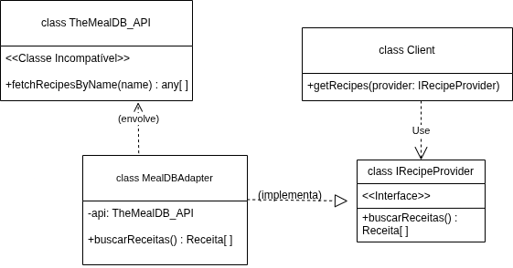

# 3.2.3 Padrão de Projeto: Adapter

Este documento descreve a implementação do Padrão de Projeto Estrutural **Adapter**, aplicado ao sistema para consumir APIs externas de receitas.

---

## 1. O que foi feito

O padrão **Adapter** foi implementado para permitir que duas interfaces incompatíveis trabalhem juntas.

No projeto, o sistema precisa de objetos `Receita` e espera uma interface (`IRecipeProvider`) para buscá-los. No entanto, queríamos usar uma API externa (ex: `TheMealDB_API`) que retorna dados em um formato totalmente diferente (ex: `strMeal`, `strInstructions`) e com métodos de nomes diferentes (ex: `fetchRecipesByName`).

Para resolver essa incompatibilidade, criamos uma classe "tradutora", o `MealDBAdapter`.

- **O Alvo (Interface):** A `IRecipeProvider` é o "contrato" que o nosso sistema entende e espera.
- **A Classe Incompatível:** A `TheMealDB_API` é a classe externa que queremos usar, mas que "fala outra língua".
- **O Adaptador:** A classe `MealDBAdapter` é o tradutor. Ela **implementa** a interface `IRecipeProvider` (para o sistema poder usá-la) e, ao mesmo tempo, **envolve** (contém) uma instância da `TheMealDB_API` para fazer o trabalho real e traduzir a resposta.

Isso permite que o nosso sistema (`Client`) trate o `MealDBAdapter` como se fosse qualquer outro `IRecipeProvider`, sem nunca saber da complexidade da API externa que está por trás.

---

## 2. Diagrama UML



## 3. Implementação

### 3.1. O Sistema (Alvo)
```ts
class Receita {
  nome: string;
  ingredientes: string[];
  passos: string;

  constructor(nome: string, ingredientes: string[], passos: string) {
    this.nome = nome;
    this.ingredientes = ingredientes;
    this.passos = passos;
  }
}

interface IRecipeProvider {
  buscarReceitas(): Receita[];
}
```

### 3.2. A Classe Incompatível
```ts
class TheMealDB_API {
  public fetchRecipesByName(name: string): any[] {
    console.log(`API Externa: Buscando por ${name}`);
    return [
      {
        strMeal: "Macarrão",
        strInstructions: "Ferva a água, cozinhe o macarrão...",
        strIngredient1: "Penne ",
        strMeasure1: "1 litro",
        strIngredient2: "Molho de tomate",
        strMeasure2: "1 lata",
      }
    ];
  }
}
```

### 3.3. O Adaptador
```ts
class MealDBAdapter implements IRecipeProvider {

  private api: TheMealDB_API;

  constructor(api: TheMealDB_API) {
    this.api = api;
  }

  public buscarReceitas(): Receita[] {
    console.log("\nAdaptador: Traduzindo a chamada do sistema...");
   
    const apiResult = this.api.fetchRecipesByName("Macarrão");

    const receitasTraduzidas: Receita[] = apiResult.map(item => {
      
      const ingredientes: string[] = [];
    
      if (item.strIngredient1) {
        ingredientes.push(`${item.strMeasure1} ${item.strIngredient1}`);
      }
      if (item.strIngredient2) {
        ingredientes.push(`${item.strMeasure2} ${item.strIngredient2}`);
      }

      
      return new Receita(
        item.strMeal,     
        ingredientes,
        item.strInstructions 
      );
    });

    console.log("Adaptador: Tradução concluída!");
    return receitasTraduzidas;
  }
}
```

### 3.4. O Cliente
```ts
console.log("Executando o Padrão Adapter");


let meuProvedorDeReceitas: IRecipeProvider;

const apiExterna = new TheMealDB_API();

meuProvedorDeReceitas = new MealDBAdapter(apiExterna);

const receitas = meuProvedorDeReceitas.buscarReceitas();

console.log("\nSistema: Receitas recebidas com sucesso!");
console.log(receitas);
```

### 4. Dependências

Para rodar:

- **Node.js** (que inclui o npm)
- **TypeScript**
- **ts-node** (para executar o TypeScript diretamente)


### 5. Como Rodar

#### Primeiro passo:
```ts
npx tsc adapter.ts
```
#### Segundo passo:
```ts
node adapter.js
```

### 6. Histórico de Versão


| Versão | Data | Alteração | Responsável | Revisor | Data de revisão |
| ------ | ---- | --------- | ----------- | ------- | --------------- |
| 1.0    | 23/10/2025 | Criação do documento |  Mylena Mendonça| | |
