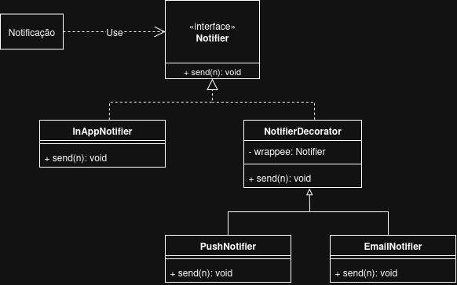

# 3.2.4. Decorator

## Introdução

O padrão Decorator é um padrão de projeto estrutural que permite adicionar funcionalidades a um objeto de forma dinâmica e flexível, sem modificar sua estrutura original. No sistema de notificação, esse padrão foi utilizado para permitir a combinação de diferentes canais de envio de notificações, como In-App, Email e Push, de forma eficiente e sem a necessidade de criar inúmeras subclasses. Ou seja, ele permite que você adicione ou remova comportamentos a um objeto de forma flexível e modular, sem a necessidade de alterar sua estrutura interna ou criar subclasses para cada combinação possível de comportamentos. Também chamado de “Wrapper”, é o quinto padrão de projeto estrutural listado pela GoF.

## Metodologia

A aplicação do padrão Decorator no sistema de notificação seguiu uma abordagem orientada a objetos, com o objetivo de criar uma estrutura extensível e de fácil manutenção. O objetivo principal foi adicionar funcionalidades extras de forma modular e sem alterar os objetos e classes existentes.

1 Análise dos Requisitos Funcionais
Primeiro, foram identificados os canais de notificação que precisavam ser combinados de maneira flexível:
- In-App: Notificação simples dentro do aplicativo.
- E-mail: Notificação enviada para o e-mail do usuário.
- Push: Notificação enviada diretamente para o dispositivo do usuário.

2 Escolha do Padrão Decorator
- O padrão Decorator foi escolhido para a implementação devido aos seguintes motivos:
- A necessidade de adicionar funcionalidades de forma flexível sem modificar as classes existentes;
- Necessidade de evitar a criação de muitas subclasses com combinações diferentes de funcionalidades;
- Manter o código aberto para extensão, mas fechado para modificação (OCP), conforme recomendado pelos princípios SOLID;


## Diagrama UML

<center>
<p style="text-align: center"><b>Figura 1:</b> Diagrama UML para o Decorator utilizado no projeto.</p>

<font size="3">
<p style="text-align: center">
<b>Autor(es):</b>  
<a href="https://github.com/SAnjos3" target="_blank">Gabriel Soares dos Anjos</a>, 
<a href="https://github.com/eduardoferre" target="_blank">Eduardo Ferreira</a>,
<a href="https://github.com/fbressa" target="_blank">Filipe Bressanelli Azevedo Filho</a>. 2025
<br>Link Artefato: <a href="https://drive.google.com/file/d/1jKP6kD5C3YxM8uC7Fxhka0cHLZTGAUKM/view?usp=drive_link" target="_blank">Draw.io</a>
</p>
</font> 

</center>


## Implementação

### Decorator no Sistema de Notificação
```dart
// Enum de tipos de notificação (exemplo)
enum TipoNotificacao {
  NOVO_SEGUIDOR = "NOVO_SEGUIDOR",
  CURTIDA_RECEITA = "CURTIDA_RECEITA",
  COMENTARIO_RECEITA = "COMENTARIO_RECEITA",
  COMENTARIO_CHECKIN = "COMENTARIO_CHECKIN",
  ATUALIZACAO_RANKING = "ATUALIZACAO_RANKING",
}


class Notificacao {
  constructor(
    public tipo: TipoNotificacao,
    public mensagem: string,
    public destinatario: string,
    public dataEnvio: Date = new Date(),
    public lida: boolean = false
  ) {}

  marcarComoLida(): void {
    this.lida = true;
  }
}

// INTERFACE BASE: Notifier
// Define o contrato que todos os notificadores devem seguir.

interface Notifier {
  send(n: Notificacao): void;
}


// CLASSE CONCRETA: InAppNotifier
// Implementação padrão, envia uma notificação “in-app”.

class InAppNotifier implements Notifier {
  send(n: Notificacao): void {
    console.log(`[In-App] Notificação para ${n.destinatario}: ${n.mensagem}`);
  }
}

// CLASSE ABSTRATA: NotifierDecorator 
abstract class NotifierDecorator implements Notifier {
  protected wrappee: Notifier;

  constructor(notifier: Notifier) {
    this.wrappee = notifier;
  }

  send(n: Notificacao): void {
    // delega para o objeto interno antes de adicionar o comportamento
    this.wrappee.send(n);
  }
}


//DECORADOR CONCRETO: EmailNotifier
class EmailNotifier extends NotifierDecorator {
  send(n: Notificacao): void {
    super.send(n); // envia via canal anterior (In-App, por exemplo)
    this.enviarEmail(n);
  }

  private enviarEmail(n: Notificacao): void {
    console.log(`[E-mail] Enviado para ${n.destinatario}: ${n.mensagem}`);
  }
}


// DECORADOR CONCRETO: PushNotifier
class PushNotifier extends NotifierDecorator {
  send(n: Notificacao): void {
    super.send(n); // envia via canais anteriores (In-App, Email, etc.)
    this.enviarPush(n);
  }

  private enviarPush(n: Notificacao): void {
    console.log(`[Push] Enviado para ${n.destinatario}: ${n.mensagem}`);
  }
}


// Simulação do uso real do padrão Decorator empilhando múltiplos canais de envio.

function main(): void {
  console.log("=== PADRÃO DECORATOR – SISTEMA DE NOTIFICAÇÕES ===");

  // --- 1. Cria o pipeline de notificadores ---
  // Podemos empilhar quantos quisermos:
  // In-App → Email → Push
  const notificadorComposto = new PushNotifier(
    new EmailNotifier(
      new InAppNotifier()
    )
  );

  // --- 2. Cria uma notificação de exemplo ---
  const notificacao = new Notificacao(
    TipoNotificacao.COMENTARIO_RECEITA,
    "Seu bolo de chocolate recebeu um novo comentário!",
    "ChefAna"
  );

  // --- 3. Envia a notificação via todos os canais ---
  notificadorComposto.send(notificacao);

  console.log("\nEnvio concluído com sucesso!");
}

// Executar a função principal
main();

```

## Tabela de Participação
| Integrante | Contribuições Principais |
|-------------|------------------------------------------------------------------------------------------|
| [Eduardo Ferreira](https://github.com/eduardoferre) | Responsável principal pelo desenvolvimento do padrão **Decorator**, incluindo estruturação do código, explicação conceitual e formatação do conteúdo em Markdown. |
| [Filipe Bressanelli Azevedo Filho](https://github.com/fbressa) | Contribuiu na documentação e revisão do texto explicativo sobre o padrão Decorator e na elaboração do UML. |
| [Gabriel Soares dos Anjos](https://github.com/SAnjos3) | Contribuiu na documentação e revisão do texto explicativo sobre o padrão Decorator e na elaboração do UML. |


## Referências Bibliográficas
> REFACTORING.GURU. Decorator. [Acessado em: 20 out. 2025.](https://refactoring.guru/design-patterns/decorator) 

> GAMMA, E. et al. Padrões de Projeto: Soluções Reutilizáveis de Software Orientado a Objetos. Porto Alegre: Bookman, 2000.

> SERRANO, Milene. AULA - GOFs Estruturais. [Apresentação de slides utilizada na disciplina de Arquitetura e Desenho de Software] – [Universidade de Basilia], 2025.

> SOFTPLAN. Padrão de projeto Decorator. [Acessado em: 20 out. 2025.](https://www.softplan.com.br/tech-writers/padrao-de-projeto-decorator/) 


| Versão | Data | Descrição | Autor | Revisor |
|--------|------|-----------|-------|---------|
| `1.0`  | 23/10/2025 | Criação do documento inicial detalhando a implementação do padrão Decorator. | [Eduardo Ferreira](https://github.com/eduardoferre)|  [Filipe Bressanelli Azevedo Filho](https://github.com/fbressa), [Gabriel Soares dos Anjos](https://github.com/SAnjos3) |
