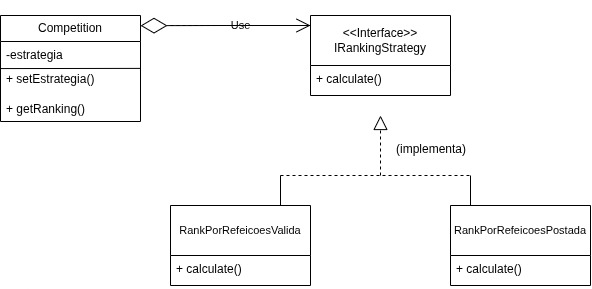

# 3.3.1 Padrão de Projeto: Strategy 


Este documento descreve a implementação do Padrão de Projeto Comportamental **Strategy**, aplicado ao sistema de ranking da aplicação de competições de alimentação.

---

## 1. O que foi feito

O padrão **Strategy** foi implementado para resolver o problema de calcular o ranking da competição de diferentes maneiras.

No projeto, a classe `Competicao` precisa gerar um ranking de membros. No entanto, a regra para esse ranking pode mudar: um mês, o ranking pode ser por **refeições válidas**, e no outro, por **receitas postadas**.

Para evitar uma série de `if/else` dentro da classe `Competicao` e seguir o **Princípio Aberto/Fechado**, os algoritmos foram isolados em classes separadas, chamadas *estratégias*.

- **O Contexto:** A classe `Competicao` é o contexto. Ela não sabe a lógica do cálculo, apenas possui uma referência a uma estratégia.  
- **A Interface:** A `IRankingStrategy` é o "contrato" que define que toda estratégia deve ter um método `calculate()`.  
- **As Estratégias Concretas:** As classes `RankPorRefeicoesValidas` e `RankPorRefeicoesPostada` implementam a interface, cada uma com sua própria lógica de ordenação.  

Isso permite que o cliente troque a regra de ranking da `Competicao` em tempo de execução usando o método `setEstrategia()`.

---

## 2. Diagrama UML

O diagrama abaixo ilustra a relação entre as classes:



---

## 3. Implementação

### 3.1. Tipos e Interface

```ts
type Membro = {
  id: string;
  nome: string;
  ContagemDeRefeicoesValidas: number;
  ContagemDeReceitasPostadas: number;
};

interface IRankingStrategy {
  calculate(data: Membro[]): Membro[];
}
```
### 3.2. Estratégias Concretas

```ts
class RankPorRefeicoesValidas implements IRankingStrategy {
  public calculate(Membros: Membro[]): Membro[] {
    console.log("Lógica: Calculando ranking por 'refeições válidas'");

    const MembrosClassificados = [...Membros];
    MembrosClassificados.sort((a, b) => b.ContagemDeRefeicoesValidas - a.ContagemDeRefeicoesValidas);
    return MembrosClassificados;
  }
}

class RankPorRefeicoesPostada implements IRankingStrategy {
  public calculate(Membros: Membro[]): Membro[] {
    console.log("Lógica: Calculando ranking por 'receitas postadas'");

    const MembrosClassificados = [...Membros];
    MembrosClassificados.sort((a, b) => b.ContagemDeReceitasPostadas - a.ContagemDeReceitasPostadas);
    return MembrosClassificados;
  }
}
```

### 3.3. O Contexto
```ts
class Competicao {
  private estrategia: IRankingStrategy;

  constructor(estrategia: IRankingStrategy) {
    this.estrategia = estrategia;
  }

  public setEstrategia(estrategia: IRankingStrategy) {
    this.estrategia = estrategia;
  }

  public calcularRanking(Membros: Membro[]): void {
    console.log("Contexto: Solicitando o cálculo do ranking para a estratégia");
    const result = this.estrategia.calculate(Membros);
    const nomes = result.map((Membro) => Membro.nome);
    console.log(`Resultado do Ranking: [${nomes.join(", ")}]`);
  }
}
```

### 3.4. O Cliente (Código de Execução)
```ts
const Maria: Membro = { id: "1", nome: "Alice", ContagemDeRefeicoesValidas: 25, ContagemDeReceitasPostadas: 5 };
const João: Membro = { id: "2", nome: "Bob", ContagemDeRefeicoesValidas: 22, ContagemDeReceitasPostadas: 10 };

const ListaMembro = [João, Maria];

const EstrategiaRefeicao = new RankPorRefeicoesValidas();
const EstrategiaReceita = new RankPorRefeicoesPostada();

const competicao = new Competicao(EstrategiaRefeicao);

console.log('Cliente: Estratégia definida → "Rankear por Refeições".');
competicao.calcularRanking(ListaMembro);

console.log('');

console.log('Cliente: Mudando estratégia → "Rankear por Receitas".');
competicao.setEstrategia(EstrategiaReceita);
competicao.calcularRanking(ListaMembro);

```
### 4. Dependências

Para rodar:

- **Node.js** (que inclui o npm)
- **TypeScript**
- **ts-node** (para executar o TypeScript diretamente)


### 5. Como Rodar
```ts
npx ts-node strategy.ts
```

### 6. Tabela de Participação do Projeto

| Integrante         | Contribuições Principais                                                                 |
|--------------------|------------------------------------------------------------------------------------------|
| **Mylena Mendonça** | Estruturação do arquivo, criação e formatação do documento em Markdown, elaboração e desenvolvimento do padrão comportamental Strategy, ajustes de estilo e revisão final de todo o conteúdo.  |
| **Yago**            | Contribuiu no desenvolvimento do padrão e na criação do diagramas UML correspondente |
| **Artur**           | Contribuiu no desenvolvimento do padrão comportamental Strategy  e auxiliou na documentação. |
| **Marcos**          | criação do diagrama UML  e revisão final. |


### 7. Histórico de Versão


| Versão | Data | Alteração | Responsável | Revisor | Data de revisão |
| ------ | ---- | --------- | ----------- | ------- | --------------- |
| 1.0    | 22/10/2025 | Criação do documento |  Mylena Mendonça| | |