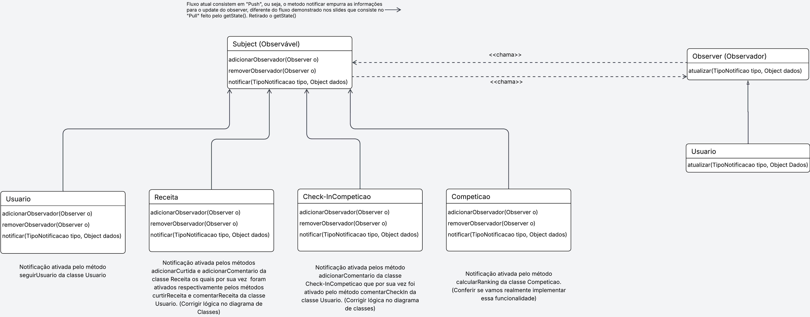

# 3.3.2. Observer
Este documento descreve a implementação do Padrão de Projeto Comportamental Observer, aplicado ao sistema de notificação da aplicação.

## Princípios e Vantagens
A adoção do padrão Observer traz diversos benefícios alinhados aos princípios de bom design de software:
- **Desacoplamento:** O `Subject` (observado) não conhece as classes concretas de seus `Observers` (observadores), apenas a interface. Isso permite que os "publicadores" (como `Receita`) e os "assinantes" (como `Usuario`) evoluam de forma independente.
- **Flexibilidade e Extensibilidade:** Novos `Observers` (ouvintes) podem ser adicionados ou removidos do `Subject` a qualquer momento, sem a necessidade de modificar o código do `Subject`.
- **Responsabilidade Única:** O `Subject` foca em manter seu estado e notificar sobre mudanças. O `Observer` foca em como reagir a essas mudanças, separando as lógicas de negócio.
- **Comunicação Broadcast:** Permite que uma única mudança de estado em um objeto seja eficientemente transmitida (broadcast) para múltiplos objetos interessados (uma relação "um-para-muitos").


## Casos de Uso

##### ✅ Quando usar Observer?
O padrão Observer é indicado quando:  
- Uma mudança no estado de um objeto (`Subject`) requer que outros objetos (`Observers`) sejam informados.  
- Queremos que um objeto possa notificar outros sem estar fortemente acoplado a eles (ex: `Receita` notificando `Usuario` sobre um comentário).  
- O número de objetos que precisam ser notificados pode mudar dinamicamente em tempo de execução.

##### 🚫 Quando NÃO usar?
Evite o padrão Observer quando:
- A comunicação é simples, síncrona e sempre entre os mesmos dois objetos (uma chamada de método direta é mais simples).
- O `Subject` precisa saber exatamente quem é o `Observer` e chamar métodos específicos dele que não estão na interface.
- A adição do padrão cria uma complexidade desnecessária para uma simples atualização de campo (over-engineering).

## Estrutura do Observer

A estrutura do Observer (Modelo Push) envolve:

1.  **Subject (interface):** define os métodos que o objeto observável ("publicador") deve implementar (`adicionarObservador`, `removerObservador`, `notificar`).  
2.  **Observer (interface):** define o método de atualização que o observador ("ouvinte") deve implementar (`atualizar`).  
3.  **ConcreteSubject (concreto):** implementa a interface `Subject`, mantém a lista de observadores e chama `notificar()` quando seu estado muda (ex: `Receita`, `Competicao`, `CheckIn`, `Usuario`).
4.  **ConcreteObserver (concreto):** implementa a interface `Observer` e define a ação a ser tomada quando seu método `atualizar()` é chamado (ex: `Usuario`).

## 1. Modelagem no Projeto
O padrão **Observer** foi implementado para resolver o problema de notificar um objeto sobre mudanças no estado de outro, garantindo um baixo acoplamento entre eles.

No projeto, a classe `Usuario` precisa ser informada em tempo real quando diversos eventos ocorrem, como receber um novo comentário em uma `Receita`, ganhar um `NOVO_SEGUIDOR` (um evento relacionado a própria classe usuário), ou quando o `Ranking` de uma `Competicao` é atualizado.

Para evitar que as classes `Subject` (como `Receita`) tivessem uma dependência direta e "tivessem conhecimento" sobre a classe `Usuario` (o que violaria o Princípio Aberto/Fechado), foi implementado um mecanismo de assinatura para as interfaces (`Object` e `Subject`). Foi utilizado o **Modelo Push**, onde o `Subject` "empurra" os dados da notificação para os `Observers`.

* **A Interface (Sujeito):** A `Subject` é o "contrato" que define que todo objeto observável deve ter os métodos `adicionarObservador(Observer o)`, `removerObservador(Observer o)` e `notificar(TipoNotificacao tipo, Object dados)`.

* **A Interface (Observador):** A `Observer` é o "contrato" que define que todo objeto assinante deve ter um método `atualizar(TipoNotificacao tipo, Object dados)`.

* **Os Sujeitos Concretos:** As classes `Receita`, `Competicao`, `CheckIn` e a própria `Usuario` implementam a interface `Subject`. Cada uma é responsável por manter sua própria lista de observadores e chamar seu método `notificar()` quando um gatilho interno ocorre (ex: a `Receita` chama `notificar()` dentro do seu método `adicionarComentario`).

* **O Observador Concreto:** A classe `Usuario` é o principal e único observador concreto, implementando a interface `Observer`. Seu método `atualizar()` é o receptor central que "ouve" as notificações de todos os Sujeitos que ele assina, recebe os dados (`tipo` e `dados`) e processa a notificação.

## 2. Diagrama UML
O diagrama abaixo ilustra a relação entre as classes:


<center>
<p style="text-align: center"><b>Figura 1:</b> Diagrama UML Observer</p>

<b>Autor(es):</b>  <a href="https://github.com/SAnjos3" target="_blank">Gabriel Soares dos Anjos</a>, <a href="https://github.com/fbressa" target="_blank">Filipe Bressanelli</a>, <a href="https://github.com/eduardoferre" target="_blank">Eduardo Ferreira</a>. 2025
<br>Link Artefato: <a href="https://lucid.app/lucidspark/9d94d4cd-d376-4c12-ac39-d209063a5b1f/edit?invitationId=inv_af100e84-6237-43c2-8b79-1792b09b3f12&page=0_0#" target="_blank">Draw.io</a>
</p>
</font> 
</center>
## 3. Implementação

A implementação foi dividida em uma estrutura de pastas para melhor organização.

### 3.1 Interfaces

As interfaces `Subject` e `Observer` definem o contrato do padrão e estão localizadas na pasta `src/interfaces`.

**`observer/src/interfaces/Subject.ts`**
```typescript
import { TipoNotificacao } from "../domain/TipoNotificacao";
import { Observer } from "./Observer";

export interface Subject {
    adicionarObservador(o: Observer): void;
    removerObservador(o: Observer): void;
    notificar(tipo: TipoNotificacao, dados: any): void;
}
```

**`observer/src/interfaces/Observer.ts`**
```typescript
import { TipoNotificacao } from "../domain/TipoNotificacao";

export interface Observer {
    atualizar(tipo: TipoNotificacao, dados: any): void;
}
```

### 3.2 Classes Concretas

As classes que implementam as interfaces `Subject` e `Observer` estão na pasta `src/concrete`.

#### 3.2.1 Classe usuário

**`observer/src/concrete/Usuario.ts`**
```typescript
import { Observer } from "../interfaces/Observer";
import { Subject } from "../interfaces/Subject";
import { TipoNotificacao } from "../domain/TipoNotificacao";
import { Receita } from "./Receita";
import { CheckIn } from "./CheckIn";

export class Usuario implements Observer, Subject {
    private nome: string;
    private observadores: Observer[] = [];

    constructor(nome: string) {
        this.nome = nome;
    }

    // --- Implementação como OBSERVER (Ouvinte) ---
    atualizar(tipo: TipoNotificacao, dados: any): void {
        console.log(`  -> Notificação para ${this.nome}: ${tipo} - ${dados}`);
    }

    // --- Implementação como SUBJECT (Falante) ---
    adicionarObservador(o: Observer): void {
        // ...
    }

    removerObservador(o: Observer): void {
        // ...
    }

    notificar(tipo: TipoNotificacao, dados: any): void {
        // ...
    }

    // --- Métodos de Ação (O que o Usuário FAZ) ---
    seguir(usuarioAlvo: Usuario): void {
        console.log(`\n--- Ação: ${this.nome} seguiu ${usuarioAlvo.getNome()} ---`);
        usuarioAlvo.serSeguidoPor(this);
    }
    
    // ... outros métodos de ação

    // --- Métodos "Gatilho" (O que ACONTECE com o Usuário) ---
    serSeguidoPor(novoSeguidor: Usuario): void {
        console.log(`[GATILHO NO USUÁRIO ${this.nome}]: Notificando observadores...`);
        this.notificar(TipoNotificacao.NOVO_SEGUIDOR, `${novoSeguidor.getNome()} começou a seguir você.`);
    }
}
```

#### 3.2.2 Classe Receita

**`observer/src/concrete/Receita.ts`**
```typescript
import { Subject } from "../interfaces/Subject";
// ... outras importações

export class Receita implements Subject {
    private titulo: string;
    private observadores: Observer[] = [];

    // ... construtor e métodos de Subject

    // --- Métodos "Gatilho" ---
    adicionarCurtida(autorDaCurtida: Usuario): void {
        console.log(`[GATILHO NA RECEITA ${this.titulo}]: Notificando observadores...`);
        this.notificar(TipoNotificacao.CURTIDA_RECEITA, `${autorDaCurtida.getNome()} curtiu sua receita.`);
    }

    adicionarComentario(comentario: string, autorDoComentario: Usuario): void {
        console.log(`[GATILHO NA RECEITA ${this.titulo}]: Notificando observadores...`);
        this.notificar(TipoNotificacao.COMENTARIO_RECEITA, `${autorDoComentario.getNome()} comentou: ${comentario}`);
    }
}
```

As classes `CheckIn` e `Ranking` seguem uma estrutura semelhante.

### 3.3 Código de Execução

O arquivo principal que orquestra e demonstra o padrão está em `src/main.ts`.

**`observer/src/main.ts`**
```typescript
import { Usuario } from "./concrete/Usuario";
import { Receita } from "./concrete/Receita";
import { CheckIn } from "./concrete/CheckIn";
import { Ranking } from "./concrete/Ranking";

function main(): void {
    // --- 1. Criar os objetos concretos ---
    const autorReceita = new Usuario("ChefAna");
    const leitor = new Usuario("LeitorBob");

    const receitaDeBolo = new Receita("Bolo de Chocolate");
    const checkin101 = new CheckIn(101);
    const rankingCompeticao = new Ranking(1);

    // --- 2. Fazer as inscrições (Ligar os fios) ---
    receitaDeBolo.adicionarObservador(autorReceita);
    checkin101.adicionarObservador(autorReceita);
    rankingCompeticao.adicionarObservador(autorReceita);
    autorReceita.adicionarObservador(autorReceita);

    console.log("--- Fluxo de Notificação Iniciado ---");

    // --- 3. Ações (Disparar os gatilhos) ---
    leitor.comentar(receitaDeBolo, "Que delícia!");
    leitor.seguir(autorReceita);
    leitor.curtir(receitaDeBolo);
    leitor.comentarCheckIn(checkin101, "Ótimo lugar!");
    rankingCompeticao.atualizarRanking();
}

// Executar a função main
main();
```

## 4. Como Rodar o Projeto

O projeto agora está estruturado com `npm` para gerenciar dependências e scripts. Siga os passos abaixo para executar o código.

### 4.1. Pré-requisitos (Dependências)

- **Node.js e npm:** Certifique-se de ter o [Node.js](https://nodejs.org/) instalado, que inclui o `npm`.

As dependências do projeto, como `typescript` e `ts-node`, estão listadas no arquivo `package.json` e serão instaladas automaticamente.

### 4.2. Passo a Passo para Execução

1.  **Navegue até a pasta do projeto:**
    Abra um terminal e navegue até a pasta `observer`.
    ```sh
    cd observer
    ```

2.  **Instale as dependências:**
    Execute o comando abaixo para instalar todos os pacotes necessários que estão definidos no `package.json`. Este comando é análogo a `pip install -r requirements.txt` em Python.
    ```sh
    npm install
    ```

3.  **Execute o código:**
    Utilize o script `start` configurado no `package.json` para compilar e rodar o arquivo `main.ts`.
    ```sh
    npm start
    ```

## Vídeo Apresentação
<iframe src="https://unbbr.sharepoint.com/sites/G6/_layouts/15/embed.aspx?UniqueId=0eb4a061-4487-40d8-94cf-dc016658de76&embed=%7B%22ust%22%3Atrue%2C%22hv%22%3A%22CopyEmbedCode%22%7D&referrer=StreamWebApp&referrerScenario=EmbedDialog.Create" width="640" height="360" frameborder="0" scrolling="no" allowfullscreen title="Reunião em separador 1-20251021_203748-Gravação de Reunião.mp4"></iframe>

## Referências Bibliograficas
> REFACTORING GURU. Design Patterns. Disponível em: <https://refactoring.guru/design-patterns>. Acesso em: 23 out. 2025.

> SERRANO, Milene. AULA - GOFs Comportamentais. [Apresentação de slides utilizada na disciplina de Arquitetura e Desenho de Software] – [Universidade de Basilia], 2025.
>
## Tabela de Participação do Projeto

| Integrante            | Contribuições Principais                                                                                                                                                                      |
| --------------------- | --------------------------------------------------------------------------------------------------------------------------------------------------------------------------------------------- |
| **Gabriel Soares**    | Estruturação do arquivo, criação e formatação do documento em Markdown, elaboração e desenvolvimento do padrão comportamental Observer, ajustes de estilo e revisão final de todo o conteúdo. |
| **Felipe Bressaneli** | Contribuiu no desenvolvimento  e revisão do padrão e na criação do diagramas UML correspondente                                                                                               |
| **Eduardo Ferreira**  | Contribuiu no desenvolvimento e revisão do padrão e na criação do diagramas UML correspondente                                                                                                |


## 7. Histórico de Versão


| Versão | Data       | Alteração            | Responsável                   | Revisor | Data de revisão |
| ------ | ---------- | -------------------- | ----------------------------- | ------- | --------------- |
| 1.0    | 22/10/2025 | Criação do documento | [Gabriel](github.com/SAnjos3) |         | 23/10/2025      |